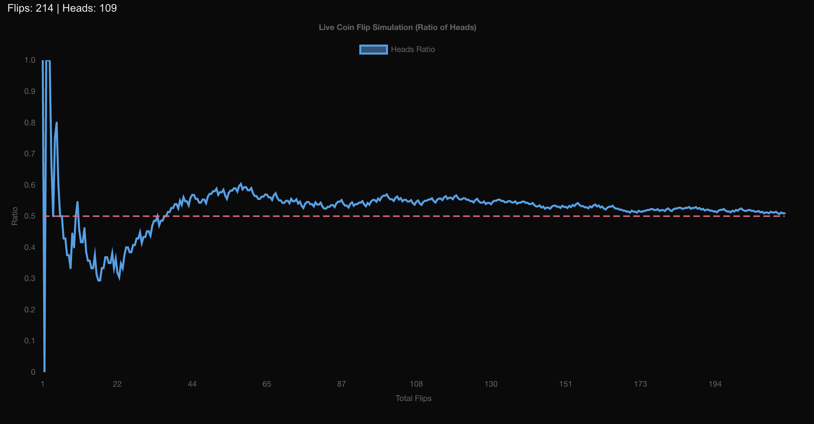

# Probability Chart - Live Coin Flip Simulation

A dynamic Next.js application that demonstrates the Law of Large Numbers through a live coin flip simulation. Watch as the ratio of heads approaches the theoretical probability of 0.5 over time.

## Screenshot



## Features

- Real-time coin flip simulation
- Interactive line chart using Chart.js
- Visual reference line showing the theoretical average (0.5)
- Live statistics display
- Responsive design

## Tech Stack

- **Framework**: Next.js 15.4.5
- **Runtime**: React 19.1.0
- **Charting**: Chart.js 4.5.0 with react-chartjs-2
- **Annotations**: chartjs-plugin-annotation 3.1.0
- **Styling**: Tailwind CSS 4.0

## Prerequisites

Before you begin, ensure you have the following installed on your system:

- **Node.js**: Version 18.17 or later
  - Download from [nodejs.org](https://nodejs.org/)
  - Verify installation: `node --version`
- **npm**: Usually comes with Node.js
  - Verify installation: `npm --version`

## Installation

### 1. Clone the Repository

```bash
git clone https://github.com/muba00/exp-probability-chart
cd exp-probability-chart
```

### 2. Install Dependencies

```bash
npm install
```

This will install all required dependencies including:

- Next.js framework
- React and React DOM
- Chart.js charting library
- react-chartjs-2 React wrapper for Chart.js
- chartjs-plugin-annotation for reference lines
- Tailwind CSS for styling
- ESLint for code linting

## Running the Application

### Development Mode

Start the development server with Turbopack (faster builds):

```bash
npm run dev
```

The application will be available at [http://localhost:3000](http://localhost:3000)

### Production Build

Build the application for production:

```bash
npm run build
```

### Start Production Server

After building, start the production server:

```bash
npm start
```

## Project Structure

```
exp-probability-chart/
├── public/                 # Static assets
├── src/
│   └── app/
│       ├── components/
│       │   └── DynamicLineChart.js  # Main chart component
│       ├── globals.css     # Global styles
│       ├── layout.js       # Root layout
│       └── page.js         # Home page
├── package.json           # Dependencies and scripts
├── next.config.mjs        # Next.js configuration
├── tailwind.config.js     # Tailwind CSS configuration
└── README.md             # This file
```

## How It Works

The application simulates coin flips at regular intervals (200ms) and updates a live chart showing:

1. **X-axis**: Total number of flips
2. **Y-axis**: Ratio of heads (0 to 1)
3. **Blue line**: Actual ratio progression
4. **Red dashed line**: Theoretical average (0.5)

As the number of flips increases, you'll observe the ratio converging towards 0.5, demonstrating the Law of Large Numbers.

## Configuration

### Update Simulation Speed

To change the simulation speed, modify the `UPDATE_INTERVAL_MS` constant in `src/app/components/DynamicLineChart.js`:

```javascript
const UPDATE_INTERVAL_MS = 200; // Milliseconds between flips
```

### Chart Customization

The chart can be customized by modifying the `options` object in the same file. You can adjust:

- Colors
- Animation settings
- Scale ranges
- Reference line properties

## Troubleshooting

### Common Issues

1. **Port already in use**: If port 3000 is busy, Next.js will automatically use the next available port.

2. **Module not found errors**: Ensure all dependencies are installed:

   ```bash
   rm -rf node_modules package-lock.json
   npm install
   ```

3. **Chart not rendering**: Check that Chart.js plugins are properly registered in the component.

### Browser Compatibility

This application works best with modern browsers that support:

- ES2018+ features
- Canvas API
- CSS Grid and Flexbox

## Contributing

1. Fork the repository
2. Create a feature branch: `git checkout -b feature-name`
3. Make your changes
4. Run tests: `npm run lint`
5. Commit changes: `git commit -m "Description"`
6. Push to branch: `git push origin feature-name`
7. Open a Pull Request

## License

This project is open source and available under the [MIT License](LICENSE).

## Contact

For questions or support, please open an issue in the repository.
